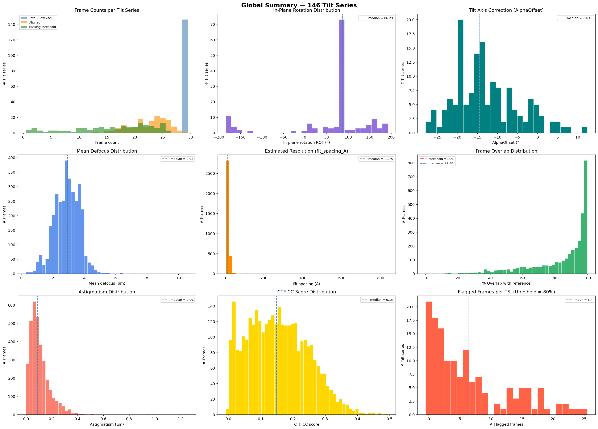
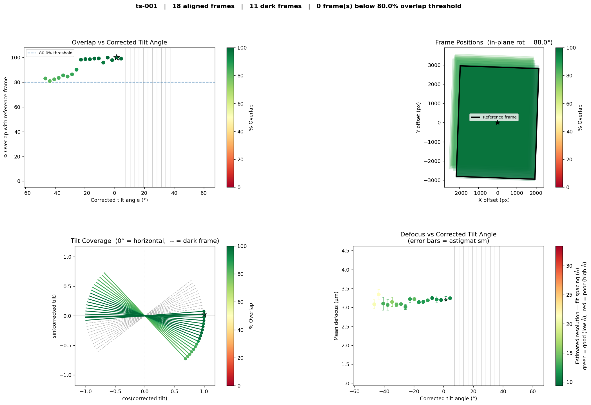

# aretomo-tilt-series-qc

Quality-control diagnostics for [AreTomo](https://github.com/czimaginginstitute/AreTomo3) cryo-ET tilt series alignments.

Parses `.aln` and `_CTF.txt` output files from AreTomo, computes per-frame overlap and CTF metrics, produces diagnostic plots for every tilt series, and generates an interactive HTML viewer for rapid dataset review.

---

## Features

- Parses all `.aln` alignment files in a directory in a single pass
- Computes **% overlap** of each frame with the reference frame (translational drift metric)
- Attaches **CTF parameters** (defocus, astigmatism, fit spacing, CC score) from `_CTF.txt` files
- Flags frames below a user-defined overlap threshold
- Produces a **4-panel diagnostic plot** per tilt series:
  - Panel 1 — Overlap % vs corrected tilt angle
  - Panel 2 — Spatial frame positions (rectangle overlay)
  - Panel 3 — Tilt coverage diagram (symmetric lines through origin, 0° = horizontal)
  - Panel 4 — Defocus vs tilt angle with astigmatism error bars and resolution colour coding
- Produces a **global summary plot** across all tilt series (frame counts, ROT, AlphaOffset, defocus, resolution, overlap, astigmatism, CTF CC, flagged frames)
- Generates an **interactive HTML viewer** with keyboard navigation and a per-TS dropdown
- Exports flagged frames as a TSV and all parsed data as JSON

---

## Example output

### Global summary (all tilt series)


### Per tilt-series diagnostic plot


---

## Installation

Requires Python 3.11, NumPy, and Matplotlib. A conda environment file is provided:

```bash
conda env create -f environment.yml
conda activate aretomo-parse
```

---

## Usage

```bash
python parse_aln.py --input <aln_directory> --output <output_directory> --threshold 80
```

| Argument | Default | Description |
|---|---|---|
| `--input` / `-i` | `run001` | Directory containing `.aln` (and optionally `_CTF.txt`) files |
| `--output` / `-o` | `run001_analysis` | Output directory for plots, HTML, JSON, and TSV |
| `--threshold` / `-t` | `80.0` | % overlap below which a frame is flagged |

### Example

```bash
conda run -n aretomo-parse python parse_aln.py \
    --input run001 --output run001_analysis --threshold 80
```

---

## Output files

| File | Description |
|---|---|
| `<ts-name>.png` | 4-panel diagnostic plot for each tilt series |
| `global_summary.png` | 3×3 histogram grid summarising the full dataset |
| `index.html` | Interactive HTML viewer (open in a browser) |
| `alignment_data.json` | All parsed alignment and CTF data |
| `flagged_frames.tsv` | Tab-separated list of frames below the overlap threshold |

---

## Input file format

AreTomo `.aln` files are expected in the format produced by AreTomo 3. Each file should have a corresponding `<stem>_CTF.txt` file in the same directory for CTF panels to be populated.

---

## License

MIT — see [LICENSE](LICENSE).
